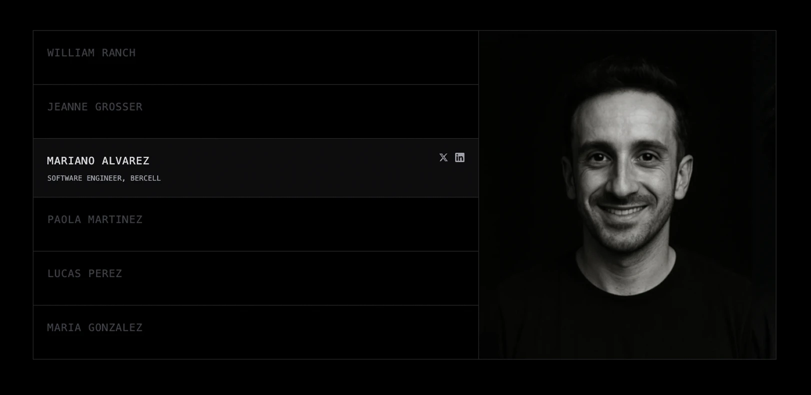
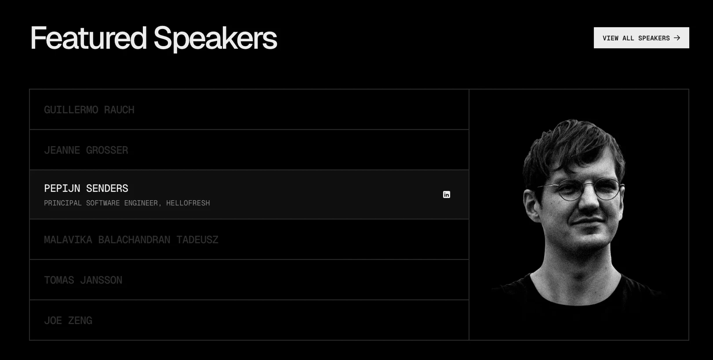

# Speaker Gallery Component

[View Live Demo](https://speaker-gallery.vercel.app/)



A React component recreation of the **Featured Speakers** section from [Vercel Ship 2025](https://vercel.com/ship) landing page.



## 📖 Overview

This project is an exercise in recreating the interactive speaker gallery component from Vercel's Ship 2025 event page. The component features a two-column layout with speaker list navigation and image preview with smooth hover transitions.

## ✨ Features

- **Interactive Speaker List**: Hover over speakers to see their photos
- **Smooth Animations**: Tailwind CSS transitions for role text and image changes
- **TypeScript Support**: Fully typed components and interfaces
- **Responsive Design**: Desktop-focused layout with proper scaling
- **Component Architecture**: Modular, reusable React components

## 🛠️ Tech Stack

- **React 19.1.0** - UI Library
- **TypeScript 5.8.3** - Type Safety
- **Vite 6.3.5** - Build Tool
- **Tailwind CSS 4.1.8** - Styling
- **Motion 12.15.0** - Animations (future enhancement)

## 📁 Project Structure

```
src/
├── assets/
│   └── images/
│       ├── speaker1.webp
│       ├── speaker2.webp
│       └── speaker3.webp
├── components/
│   ├── speaker-list/
│   │   └── speaker-list.tsx
│   ├── speaker-member/
│   │   ├── speaker-member.tsx
│   │   └── social-links.tsx
│   └── speaker-profile/
│       └── speaker-profile.tsx
├── hooks/
│   └── useSpeakerData.ts
├── types/
│   └── speaker.ts
├── speaker-gallery.tsx
└── main.tsx
```

## 🚀 Getting Started

### Installation

```bash
# Clone the repository
git clone https://github.com/creativoma/speaker-gallery.git

# Navigate to project directory
cd speaker-gallery

# Install dependencies
pnpm install

# Start development server
pnpm dev
```

### Available Scripts

```bash
pnpm dev      # Start development server
pnpm build    # Build for production
pnpm preview  # Preview production build
pnpm lint     # Run ESLint
pnpm format   # Format code with Prettier
```

## 📝 Note

**Desktop Only**: This implementation is optimized for desktop screens and may not be fully responsive on mobile devices.
